# 📝 COORD. TI - Sistema de Gestão de Chamados


O **COORD. TI** é uma plataforma de Help Desk desenvolvida para gerenciar fluxos de suporte técnico. O projeto foi construído utilizando **PHP Orientado a Objetos** sob a arquitetura **MVC**, aplicando padrões como **Service Layer** e **Repository Pattern**. Este projeto serviu como base sólida para o desenvolvimento de competências em roteamento, autoload, namespaces e segurança antes da transição para o framework Laravel.

---

## 🚀 Tecnologias e Conceitos Aplicados

* **Arquitetura MVC:** Separação clara entre Modelo, Visão e Controle.
* **Camadas Service & Repository:** Lógica de negócio isolada dos acessos ao banco de dados.
* **Autoload & Namespaces:** Organização seguindo o padrão **PSR-4** via Composer.
* **Segurança:** Criptografia de senhas com **Argon2id**.
* **Gestão de E-mail:** Recuperação de senha com **PHPMailer** e integração com **Mailtrap**.
* **Interface:** Design responsivo construído com **Bootstrap 5**.

---

## 🔑 Níveis de Acesso

O sistema gerencia permissões e visibilidade de dados através de três papéis principais:

| Nível | Permissões e Acesso |
| :--- | :--- |
| **Admin** | Acesso completo: Gestão de usuários (CRUD/Soft Delete), designação de atendentes, dashboard global e exclusão de tickets. |
| **Atendente** | Focado na resolução: Visualiza chamados abertos, assume tickets de terceiros e gerencia sua própria fila de atendimentos. |
| **Usuário** | Focado na solicitação: Abre novos chamados, acompanha o progresso e interage com o técnico no chat. |

---

## 📂 Estrutura de Diretórios

```text
├── App
│   ├── Config         # Conexão PDO com o Banco de Dados
│   ├── Controllers    # Orquestração de requisições e fluxo de páginas
│   ├── Models         # Entidades e representação dos dados
│   ├── Repositories   # Persistência e consultas SQL isoladas
│   ├── Services       # Regras de negócio, validações e integrações (Mailtrap)
│   └── Views          # Telas (app), Modais (auth) e Layouts (header/footer)
├── Public
```

📸 Demonstração das Funcionalidades
1. Autenticação e Segurança
Processo de cadastro e login com validações de campos obrigatórios e verificação de duplicidade de dados.

Recuperação de Senha: Envio de e-mail com token de segurança e formulário de reset com validações de integridade.

<p align="center">
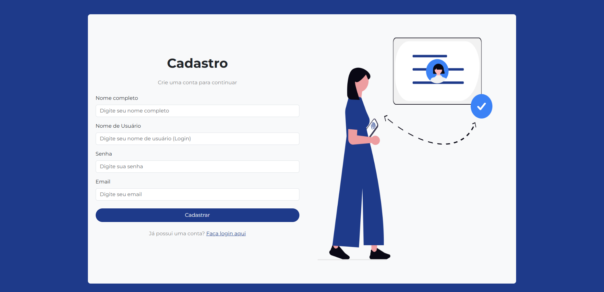
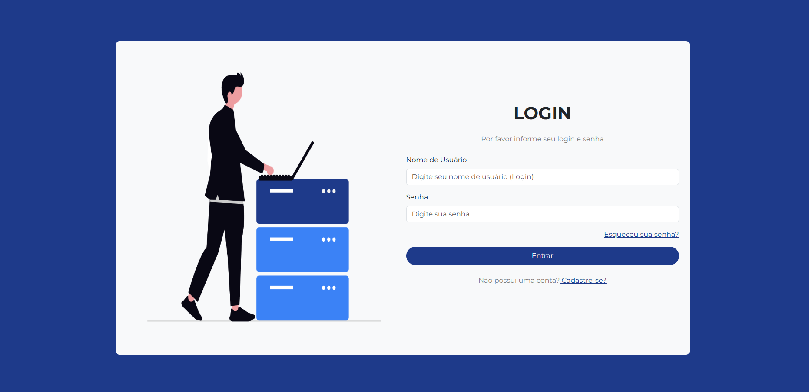
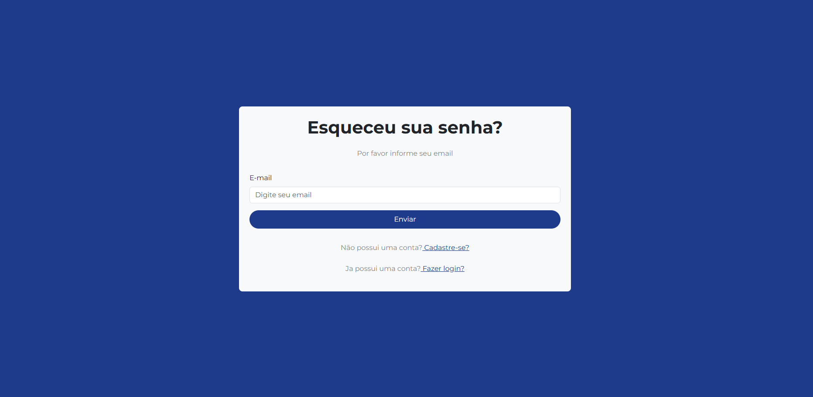
</p>

2. Dashboards e Paginação
Painéis que adaptam as estatísticas conforme o nível de acesso do usuário logado. HomePage com os últimos 6 chamados registrados e listagens com paginação dinâmica.

<p align="center">
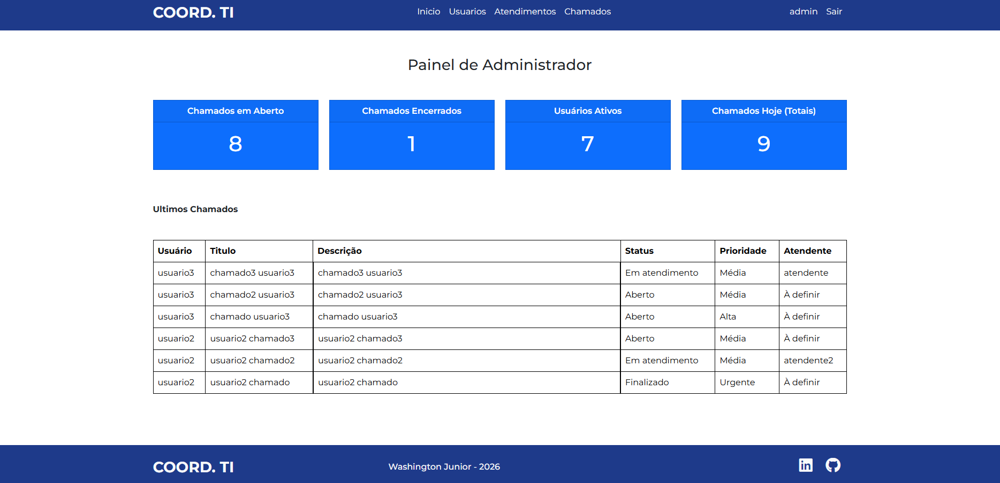
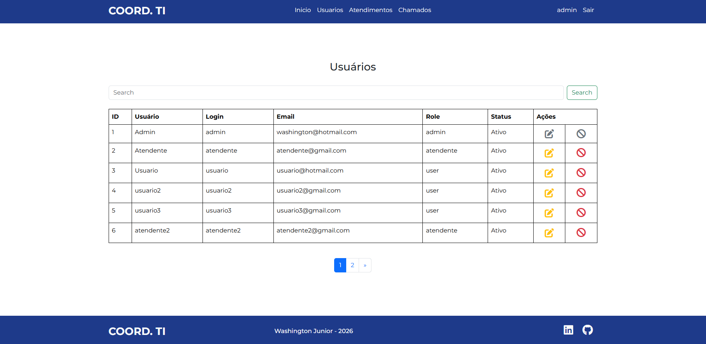
</p>
<p align="center">
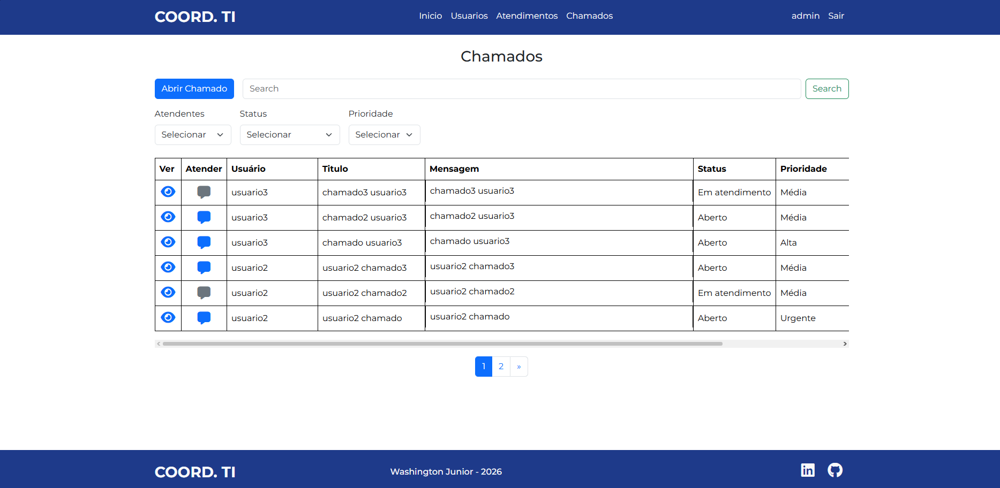
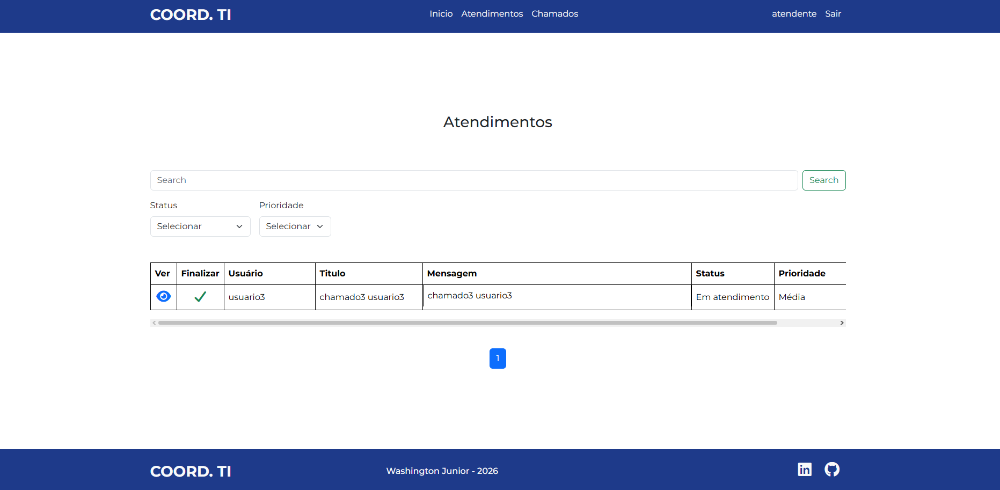
</p>

3. Interação e Chat de Chamados
Visibilidade Baseada em Role: Interface de chat estilo "bolhas" (Usuário à esquerda, Atendente à direita).

Automação de Status: O chamado muda para "Em atendimento" automaticamente na primeira interação do suporte.

Encerramento: Ao finalizar o ticket, o formulário de resposta é bloqueado.

<p align="center">
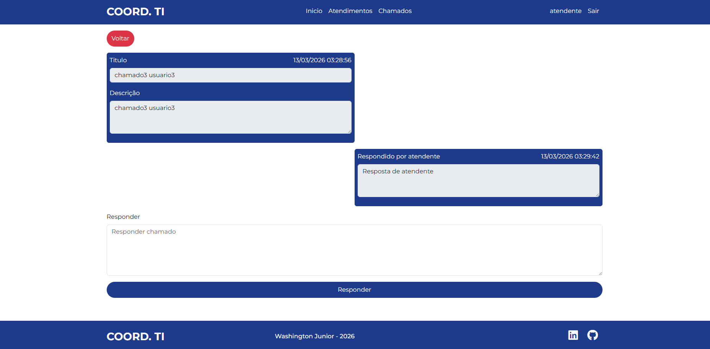
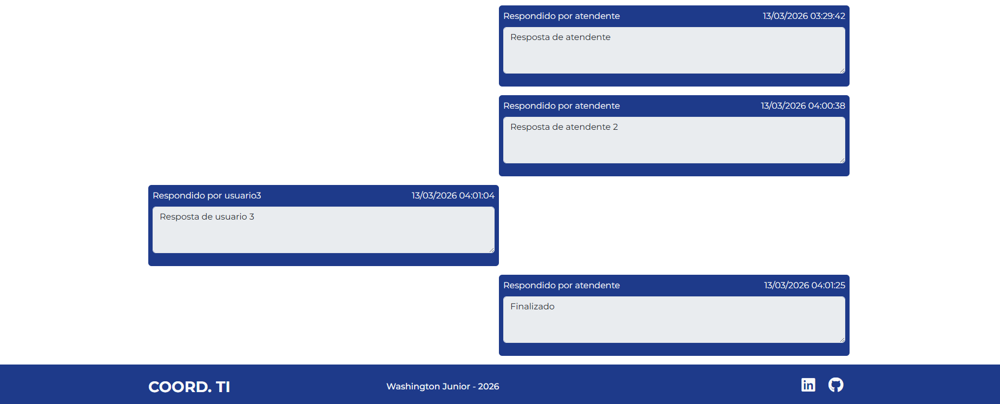
</p>

4. Filtros Avançados de Busca
O sistema permite realizar filtragens complexas e combinadas (Atendente, Status, Prioridade e Busca Textual) para localizar chamados de forma eficiente.

<p align="center">
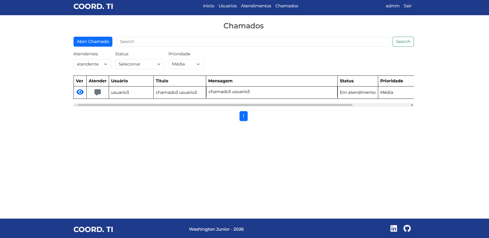
</p>

5. Gestão de Perfil e Usuários
Profile: Usuários podem editar nome, e-mail, login, senha e desativar a própria conta.

Soft Delete: O Admin pode desativar e reativar usuários sem excluir os registros do histórico.

<p align="center">
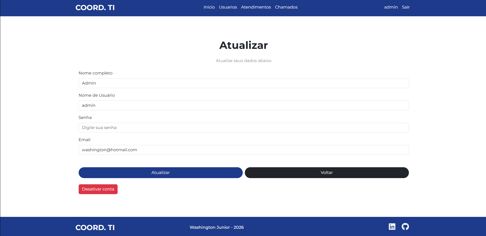
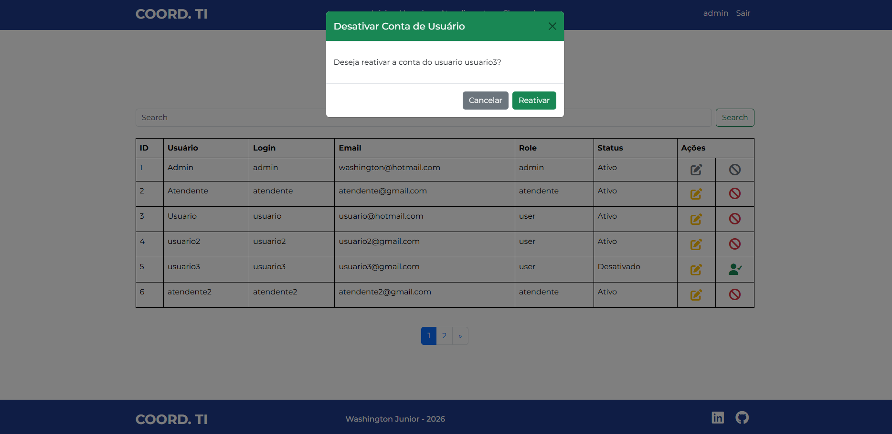
</p>

🛠️ Como Instalar e Rodar
Pré-requisitos
PHP 8.x ou superior.

MySQL/MariaDB.

Composer instalado.

Passo a Passo
Clone o projeto:

Bash

git clone [https://github.com/seu-usuario/seu-repositorio.git](https://github.com/seu-usuario/seu-repositorio.git)
Instale as dependências:

Bash

composer install
Configuração do Ambiente:


Insira suas credenciais do Banco de Dados.

Configure os dados do SMTP do Mailtrap nas variáveis correspondentes.

Banco de Dados:

Crie um banco de dados MySQL e execute os comandos de criação de tabelas (conforme as entidades em App/Models).

Servidor Web:

Configure seu servidor (Apache/Nginx) para apontar para a pasta Public.

Certifique-se de que o mod_rewrite esteja habilitado para processar as rotas amigáveis.

Nota: Este projeto foi desenvolvido para fins didáticos e portfólio pessoal.

Desenvolvido por Washington Junior - 2026

```text
│   ├── Assets         # CSS personalizado, Scripts JS e Imagens
│   └── index.php      # Front Controller (Ponto de entrada do sistema)
├── Vendor             # Dependências gerenciadas pelo Composer
└── .env               # Configurações sensíveis (Banco e SMTP)
